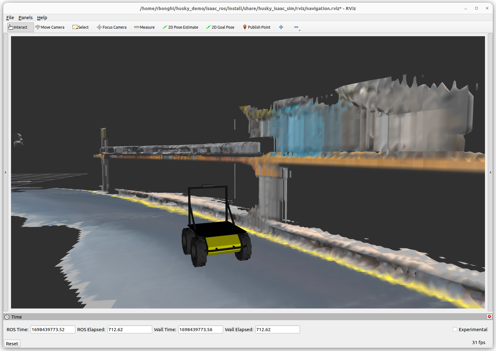
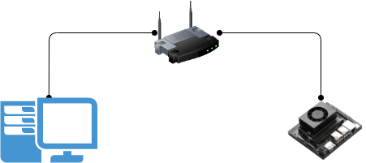
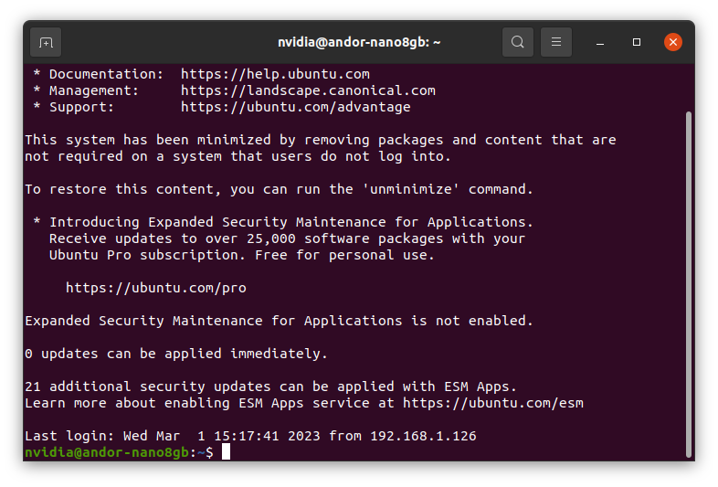
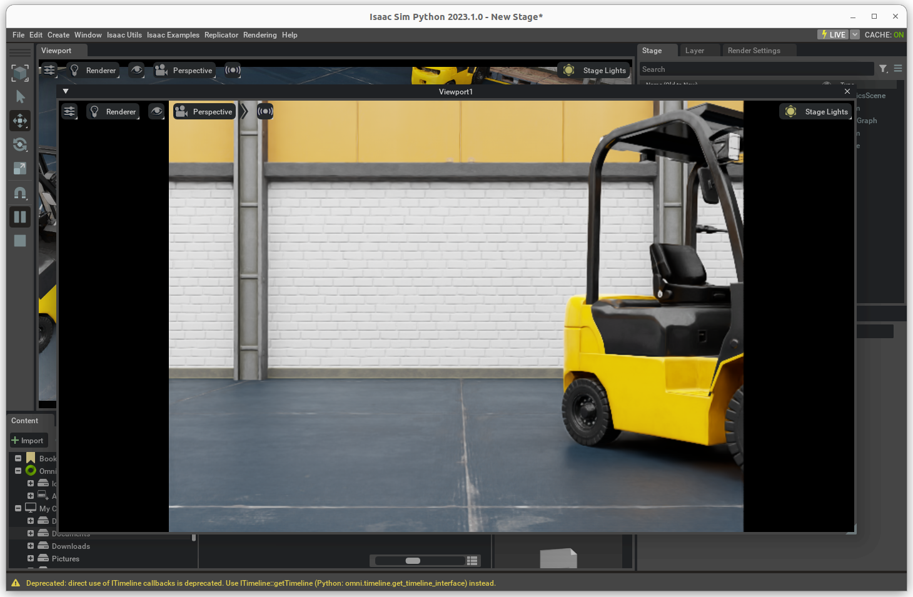
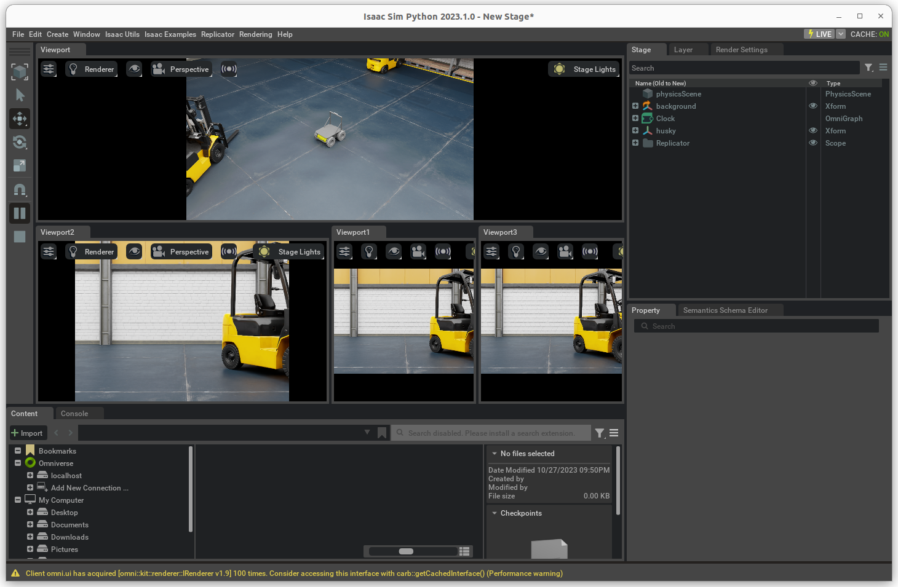
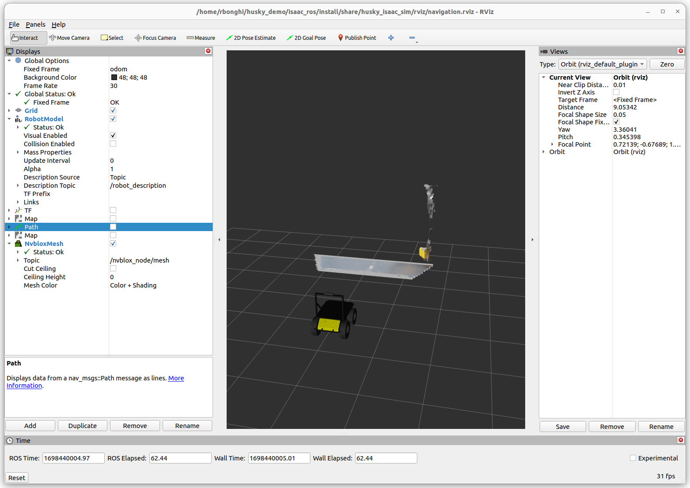

# Husky Demo



## Hardware required

Workstation:

1. Internet connection
2. x86/64 machine
3. Install Ubuntu 22.04
4. [Install ROS2 Humble](#install-ros2-humble)
5. NVIDIA Graphic card with RTX
6. Display
7. Keyboard and Mouse

NVIDIA Jetson:

1. NVIDIA Jetson Orin Nano
2. Jetpack 5.1.2

Tools:

1. Router
2. eth cables

## Setup hardware and installation

Before to start check you have all requirements and connect the driver following this image



It is preferable to connect workstation and the NVIDIA Jetson Orin Nano with a lan cable and not use WiFi.

### Install ROS2 Humble on Desktop

Follow the Isaac SIM 2023 official documentation and check or install ROS2 Humble on your desktop [Running native ROS](https://docs.omniverse.nvidia.com/isaacsim/latest/installation/install_ros.html?highlight=native%20ros#running-native-ros).

In quick steps:

1. Download ROS 2 following the instructions on the official website: [ROS 2 Humble Ubuntu 22.04](https://docs.ros.org/en/humble/Installation/Ubuntu-Install-Debians.html)
2. Source the ROS environment in the terminal. You must perform this step each time before using any ROS commands.

```console
source /opt/ros/humble/setup.bash
Install vision_msgs_package
```

3. Install vision msgs package

```console
sudo apt install ros-humble-vision-msgs
```

### Install latest NVIDIA Isaac SIM

Follow the documentation on NVIDIA Isaac SIM [Workstation install](https://docs.omniverse.nvidia.com/isaacsim/latest/installation/index.html)

1. Download the [Omniverse Launcher](https://www.nvidia.com/en-us/omniverse/)
2. [Install Omniverse Launcher](https://docs.omniverse.nvidia.com/prod_launcher/prod_launcher/installing_launcher.html)
3. Install [Cache](https://docs.omniverse.nvidia.com/prod_nucleus/prod_utilities/cache/installation/workstation.html) from the Omniverse Launcher
4. Install [Nucleus](https://docs.omniverse.nvidia.com/prod_nucleus/prod_nucleus/workstation/installation.html) from the Omniverse Launcher

Open Omniverse Launcher


Move to Library and choice "Omniverse Isaac SIM" and download the latest 2023.1.0 version


### Install Husky Demo on your workstation

Clone this repository

```console
git clone https://github.com/NVIDIA-AI-IOT/husky_demo.git
cd husky_demo
```

Run this script that is also the installer for your workstation on all tools

```console
./husky_demo.sh
```

### Install Husky Demo on NVIDIA Jetson

In this section you connect to your NVIDIA Jetson with a ssh connection, open a terminal an write

```console
ssh <IP or hostname.local>
```

where **IP** is the of NVIDIA Jetson or **hostname** is the hostname of your board.

If you are connected the output from the terminal is:



Clone this repository

```console
git clone https://github.com/NVIDIA-AI-IOT/husky_demo.git
cd husky_demo
```

Add docker group to your user

```console
sudo usermod -aG docker $USER && newgrp docker
```

Set the default nvidia runtime

You're going to be building containers, you need to set Docker's `default-runtime` to `nvidia`, so that the NVCC compiler and GPU are available during `docker build` operations.  Add `"default-runtime": "nvidia"` to your `/etc/docker/daemon.json` configuration file before attempting to build the containers:

``` json
{
    "default-runtime": "nvidia",
    "runtimes": {
        "nvidia": {
            "path": "nvidia-container-runtime",
            "runtimeArgs": []
        }
    }
}
```

Then restart the Docker service, or reboot your system before proceeding:

```console
sudo systemctl restart docker
```

Run the installer and run script

```console
./husky_demo.sh
```

## Run demo

Now you can run your Husky demo, but you need to follow the steps below

### Run on your workstation

On the second terminal run, like the message appeared

```console
ros2 launch husky_isaac_sim robot_display.launch.py
```

This script will load husky on Isaac SIM and open rviz on your terminal



If you want, you can redock manually all viewports and obtain something like that



### Script to run on your Jetson Nano

If everthing went well from the [installation](#install-husky-demo-on-nvidia-jetson), you can run the command below

```console
bash src/husky_isaac_sim/scripts/run_in_docker.sh
```

now you will see husky mapping on your rviz



## Drive Husky

There are several options:

1. Drive by keyboard
2. Drive by joystick
3. Drive with Nav2

Follow below all options

### Drive by keyboard

Open a new terminal and run

```console
ros2 run teleop_twist_keyboard teleop_twist_keyboard
```

if this package is not available, install

```console
sudo apt install ros-humble-teleop-twist-keyboard
```

### Drive by joystick

Open a new terminal and run

```console
ros2 run teleop_twist_joy teleop_twist_joy
```

if this package is not available, install

```console
sudo apt install ros-humble-teleop-twist-joy
```

### Drive with Nav2

You can simply use rviz2 and press "Goal to pose" to select a new goal for Husky to achieve.
